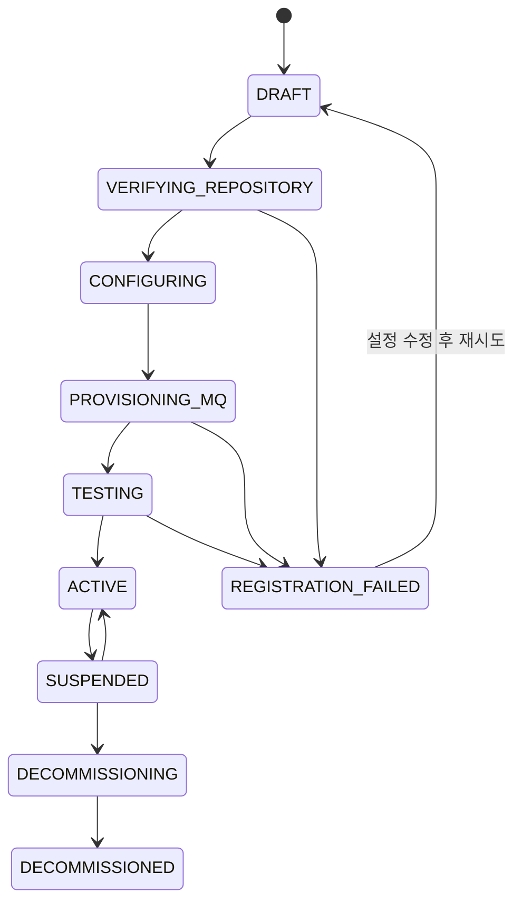

# Auto Error Handler 세부 구현 계획

상태: Draft  
작성일: 2026-09-01  
관련 문서:

- [서비스 아키텍처](service-architecture.md)
- [외부 오류 이벤트 MQ 계약 v1](contracts/external-error-event-v1.md)
- [인터랙티브 전체 흐름](../walkthrough-auto-error-handler.html)

## 1. 문서 목적

이 문서는 아키텍처를 실제 서비스로 옮길 때 개발자가 추가로 큰 구조 결정을 내리지 않아도 되도록 구현 단위, 상태 전이, 트랜잭션 경계, Worker 동작, API, 보안 통제와 완료 조건을 정의한다.

첫 목표는 다음 단일 수직 흐름을 운영 가능한 수준으로 완성하는 것이다.

```text
서비스 등록
  → GitHub 저장소·MQ·알림 연결 검증
  → 외부 오류 이벤트 수신
  → Incident 생성
  → Codex 읽기 전용 분석
  → 메신저 승인 요청
  → 사용자 승인
  → 격리 worktree 패치·검증
  → Draft Pull Request
```

## 2. 확정할 구현 기준

### 기술 기준

| 영역 | 선택 | 구현 기준 |
|---|---|---|
| Runtime | Node.js 20+ | API와 Worker의 공통 런타임 |
| Language | TypeScript strict mode | `any` 사용은 외부 경계 adapter 내부로 제한 |
| Workspace | pnpm workspace | 앱과 공통 패키지 분리 |
| API | Fastify | JSON Schema 기반 요청 검증 |
| Database | PostgreSQL | 도메인 상태의 진실 공급원 |
| DB access | Drizzle + 명시적 SQL | migration, transaction, row lock를 코드에서 확인 가능하게 유지 |
| MQ | RabbitMQ quorum queue | 외부 이벤트와 내부 command/event 전달 |
| Runtime validation | AJV Draft 2020-12 | MQ 및 HTTP 계약 공통 사용 |
| Web console | React + Vite | 등록, 사건 조회, 승인 UI |
| Object storage | S3 compatible | 원본 payload, 로그, diff, 검증 결과 |
| Git | GitHub App | 저장소 단위 최소 권한과 Draft PR |
| Telemetry | OpenTelemetry | API, MQ, Codex, Git 호출 추적 |
| Test runner | Vitest | 단위·통합·계약 테스트 |

패키지 버전은 구현 시작 시 lockfile로 고정한다. Codex SDK의 옵션 이름과 반환 타입은 설치된 `@openai/codex-sdk` 타입을 기준으로 adapter 안에 캡슐화한다.

### 배포 단위

초기에는 하나의 monorepo 안에서 다음 네 프로세스를 독립 배포한다.

1. `control-api`: 등록, 조회, 승인, integration callback
2. `event-worker`: MQ ingest, Outbox relay, notification
3. `codex-worker`: 분석과 패치 실행
4. `web-console`: 운영자와 승인자 UI

`codex-worker`는 저장소와 명령 실행 권한을 가지므로 다른 Worker와 별도 service account, network policy, node pool에서 실행한다.

## 3. 권장 저장소 구조

```text
apps/
  control-api/
    src/
      routes/
      middleware/
      server.ts
  event-worker/
    src/
      consumers/
      outbox/
      notifications/
      main.ts
  codex-worker/
    src/
      analysis/
      patch/
      workspace/
      main.ts
  web-console/
    src/
      pages/
      features/
      api/
packages/
  domain/
    src/
      services/
      incidents/
      approvals/
      patch-runs/
      events/
  contracts/
    src/
      http/
      mq/
      codex/
    schemas/
  persistence/
    src/
      schema/
      repositories/
      migrations/
  messaging/
    src/
      publisher/
      consumer/
      topology/
  codex-adapter/
    src/
      gateway.ts
      prompts/
      result-schemas/
  github-adapter/
  notification-adapters/
  observability/
  test-support/
docs/
schemas/
infra/
  docker/
  rabbitmq/
  migrations/
```

`packages/domain`은 Fastify, RabbitMQ, Codex SDK, GitHub SDK 타입에 의존하지 않는다. 외부 라이브러리는 각 adapter의 경계에서만 사용한다.

## 4. 서비스 등록 구현

### 4.1 등록 방식

외부 사용자가 RabbitMQ topology나 Git credential을 직접 만들게 하지 않는다. Self-service UI가 Control API를 호출하고, 플랫폼이 검증과 provisioning을 수행한다.

권장 상태 머신:



### 4.2 등록 API

#### 등록 초안

`POST /v1/services`

요청:

```json
{
  "name": "Payments API",
  "key": "payments-api",
  "environment": "production",
  "repository": {
    "provider": "github",
    "owner": "acme",
    "name": "payments-api",
    "defaultBranch": "main"
  },
  "diagnostics": {
    "runbookPaths": ["README.md", "docs/runbook.md"],
    "testCommands": ["pnpm lint", "pnpm test"],
    "timeoutSeconds": 900
  },
  "patchPolicy": {
    "allowedPaths": ["src/**", "test/**"],
    "deniedPaths": [".github/**", "infra/production/**"],
    "maxChangedFiles": 20,
    "maxDiffLines": 800
  }
}
```

응답:

```json
{
  "id": "svc_01...",
  "status": "DRAFT",
  "version": 1,
  "nextAction": {
    "type": "INSTALL_GITHUB_APP",
    "url": "/v1/services/svc_01.../repository-installation"
  }
}
```

규칙:

- `Idempotency-Key`가 같으면 동일 등록 결과를 반환한다.
- `organization_id + key + environment`를 unique constraint로 보호한다.
- URL로 받은 Git repository를 바로 clone하지 않고 GitHub App installation ID로 소유권을 확인한다.
- 요청의 test command는 문자열 그대로 실행하지 않는다. 허용된 package-manager command parser로 token화한다.

#### 저장소 연결

- `POST /v1/services/:serviceId/repository-installations`
- `GET /v1/integrations/github/callback`
- `POST /v1/services/:serviceId/repository-verification-runs`
- `GET /v1/services/:serviceId/repository-verification-runs/:runId`

검증 항목:

1. installation이 요청 조직에 속하는지 확인
2. 대상 repository 접근 가능 여부 확인
3. default branch와 HEAD SHA 조회
4. `AGENTS.md`, runbook path 존재 여부 확인
5. read-only clone/fetch 성공 확인
6. Draft PR에 필요한 권한이 있는지 별도 확인

#### 알림과 승인자 설정

- `PUT /v1/services/:serviceId/notification-channels`
- `POST /v1/services/:serviceId/notification-channels/:channelId/test`
- `PUT /v1/services/:serviceId/approval-policy`
- `PUT /v1/services/:serviceId/diagnostic-policy`

알림 채널은 저장 직후 테스트 메시지까지 성공해야 `verified_at`이 채워진다. 승인자 그룹은 OIDC group ID 또는 내부 role mapping을 사용한다.

#### MQ provisioning

- `POST /v1/services/:serviceId/mq-provisioning-runs`
- `GET /v1/services/:serviceId/mq-provisioning-runs/:runId`
- `POST /v1/services/:serviceId/mq-credentials/rotate`
- `DELETE /v1/services/:serviceId/mq-credentials/:credentialId`

Provisioner 작업:

1. 조직 virtual host 확인 또는 생성
2. 외부 event exchange와 ingest binding 확인
3. 서비스별 producer user 생성
4. `error.<service_key>.*.*` write permission만 부여
5. password를 Secret Manager에 저장
6. 최초 표시용 one-time retrieval token 생성
7. 감사 로그 기록

API 응답에는 credential 평문을 직접 반복 반환하지 않는다. 일회성 retrieval token은 짧은 TTL과 1회 사용을 강제한다.

### 4.3 연결 테스트

실제 오류 계약과 분리된 `com.auto-error-handler.integration.test.v1` 메시지를 추가한다.

흐름:

1. `POST /v1/services/:serviceId/activation-challenges`가 nonce와 만료 시간을 발급한다.
2. 외부 producer가 같은 exchange에 `test.<service_key>.<environment>` routing key로 nonce를 발행한다.
3. Ingest Consumer가 credential, routing, schema, publisher identity를 검증한다.
4. DB에 verification result를 저장하고 실제 Incident는 생성하지 않는다.
5. Git, MQ, notification, approval policy 검증이 모두 성공하면 `POST /activate`를 허용한다.

`ACTIVE` 전환은 transaction 안에서 현재 상태와 모든 verification 결과의 유효 기간을 다시 검사한다.

## 5. RabbitMQ topology 구현

### 외부 이벤트

| Exchange/Queue | Type | Producer | Consumer |
|---|---|---|---|
| `aeh.external.error.v1` | durable topic exchange | 등록 서비스 | 없음 |
| `aeh.ingest.error.v1` | quorum queue | exchange binding | Ingest Consumer |
| `aeh.external.error.dlx.v1` | durable topic exchange | broker policy | 없음 |
| `aeh.ingest.error.dlq.v1` | quorum queue | DLX binding | 운영 replay tool |

### 내부 이벤트

| Exchange | Routing key | Consumer |
|---|---|---|
| `aeh.internal.v1` | `incident.analysis.requested` | Analysis Worker |
| `aeh.internal.v1` | `incident.analysis.completed` | Notification Worker |
| `aeh.internal.v1` | `incident.patch.approved` | Patch Worker |
| `aeh.internal.v1` | `incident.patch.rejected` | Notification Worker |
| `aeh.internal.v1` | `incident.patch.completed` | Notification Worker |
| `aeh.internal.v1` | `notification.requested` | Notification Worker |

각 내부 메시지는 큰 도메인 payload 대신 다음 참조만 가진다.

```json
{
  "messageId": "uuid",
  "type": "incident.analysis.requested.v1",
  "aggregateId": "incident_uuid",
  "aggregateVersion": 3,
  "occurredAt": "2026-09-01T12:00:00.000Z",
  "correlationId": "incident_uuid",
  "causationId": "external_message_uuid"
}
```

Consumer는 DB에서 최신 상태를 다시 읽고 `aggregateVersion`과 허용 상태를 검증한다.

### Outbox Relay

1. `outbox_events`에서 `published_at IS NULL` 행을 `FOR UPDATE SKIP LOCKED`로 가져온다.
2. 내부 exchange에 persistent, mandatory publish한다.
3. publisher confirm을 받은 후 `published_at`과 broker metadata를 기록한다.
4. confirm 결과가 불확실하면 행을 남기고 재발행한다.
5. Consumer inbox가 중복 side effect를 막는다.

Outbox Relay는 한 번에 제한된 batch를 처리하고 service/organization별 rate limit을 적용한다.

## 6. 오류 이벤트 Ingest 구현

### 처리 순서

```text
RabbitMQ delivery
  → body byte limit 검사
  → AMQP properties 검사
  → JSON parse
  → AJV v1 schema 검증
  → credential / vhost / routing / body identity 일치 검사
  → secret·PII 탐지 및 마스킹
  → PostgreSQL transaction
      inbox_messages INSERT ON CONFLICT
      fingerprint 계산
      열린 incident 조회 또는 생성
      occurrence 저장
      outbox incident.analysis.requested 저장
  → COMMIT
  → basic.ack
```

### Transaction 의사 코드

```ts
await db.transaction(async (tx) => {
  const inserted = await inbox.insertOnce(tx, serviceId, messageId);
  if (!inserted) return;

  const incident = await incidents.findOrCreateOpen(tx, {
    serviceId,
    fingerprint,
    firstOccurrence: normalizedEvent,
  });

  await occurrences.append(tx, incident.id, normalizedEvent);
  await outbox.enqueue(tx, analysisRequested(incident));
});

channel.ack(delivery);
```

`channel.ack`는 transaction 성공 후 호출한다. Commit 후 ack 전에 Worker가 종료되어도 다음 delivery에서 inbox unique constraint가 중복을 막는다.

### Fingerprint

우선순위:

1. 생산자가 제공한 명시적 `fingerprint`
2. 정규화한 exception type + 상위 application stack frame 3개
3. route template + status code + 정규화된 message

동적 UUID, timestamp, 숫자 ID, 메모리 주소는 fingerprint 입력에서 제거한다. Fingerprint 알고리즘 버전을 `fingerprint_version`으로 저장한다.

### Retry와 DLQ

- 일시 오류: 10초, 60초, 300초 retry
- schema/권한/크기 오류: 즉시 DLQ
- retry queue publish confirm 후 원본 ack
- retry 소진 후 DLQ 이동
- DLQ replay는 운영 UI에서 사유 확인과 audit log를 요구

## 7. Incident와 분석 상태

### 주요 상태

| 상태 | 진입 조건 | 다음 동작 |
|---|---|---|
| `RECEIVED` | 첫 occurrence 저장 | 분석 작업 Outbox |
| `ANALYZING` | Analysis Worker lease 획득 | workspace 준비와 Codex 실행 |
| `AWAITING_APPROVAL` | 유효한 분석 결과 | 알림과 승인 요청 |
| `ANALYSIS_FAILED` | 재시도 소진 | 운영 알림 |
| `APPROVED` | 유효한 승인 소비 | Patch Worker 예약 |
| `PATCHING` | Patch Worker lease 획득 | 격리 변경 |
| `VALIDATING` | diff 생성 완료 | 정책·테스트 검사 |
| `PATCH_READY` | Draft PR 생성 | 결과 알림 |
| `PATCH_FAILED` | 검사 또는 PR 실패 | 제한 재시도/사람 검토 |
| `REJECTED` | 사용자 거절 | 종료 알림 |
| `EXPIRED` | 승인 만료 | 종료 또는 재분석 |

상태 변경 함수는 `incident_id, expected_state, expected_version`을 조건으로 update하며 영향 받은 행이 1개가 아니면 concurrent transition으로 처리한다.

### Worker lease

`analysis_runs`와 `patch_runs`는 다음 필드를 가진다.

- `status`
- `attempt`
- `leased_by`
- `lease_expires_at`
- `heartbeat_at`
- `started_at`
- `finished_at`

Worker는 주기적으로 heartbeat를 갱신한다. Lease가 만료된 실행은 sweeper가 다시 예약하지만, inbox/outbox와 run unique constraint가 중복 실행을 통제한다.

## 8. Codex 읽기 전용 분석 구현

### Workspace 생성

1. Incident의 `base_commit_sha`를 결정한다.
2. mirror cache를 fetch한다.
3. 사건 전용 temporary worktree를 pinned SHA에서 만든다.
4. 분석 컨테이너에 read-only mount한다.
5. Git write credential과 production credential을 제공하지 않는다.
6. 필요한 로그는 provider adapter가 사전에 가져와 redaction한 artifact로만 제공한다.

### 분석 입력

```ts
type AnalyzeIncidentInput = {
  incidentId: string;
  baseCommitSha: string;
  workspacePath: string;
  error: NormalizedErrorEvent;
  occurrences: OccurrenceSummary[];
  runbooks: RunbookDocument[];
  repositoryInstructions: string[];
  allowedEvidenceRoots: string[];
};
```

### Codex 실행

Adapter 내부 동작:

1. `new Codex()`로 SDK client 초기화
2. 사건 전용 thread 시작
3. 분석 prompt와 구조화 결과 schema 전달
4. timeout과 cancellation signal 연결
5. event stream에서 진행 상태와 tool 실행 metadata 기록
6. final response를 AJV로 검증
7. `thread_id`와 prompt/schema version 저장

SDK가 구조화 출력을 직접 강제하지 못하는 버전이라면 final response를 JSON으로 제한하고 adapter에서 엄격하게 검증한다. 검증 실패 시 같은 thread에 schema 수정 요청을 한 번만 보낸다.

### 분석 결과

```ts
type AnalysisResult = {
  summary: string;
  rootCause: string;
  confidence: "low" | "medium" | "high";
  evidence: Array<{
    kind: "source" | "log" | "config" | "test";
    locator: string;
    explanation: string;
  }>;
  proposedChanges: Array<{
    path: string;
    purpose: string;
    operation: "modify" | "add" | "delete";
  }>;
  validationPlan: string[];
  risk: "low" | "medium" | "high";
  missingInformation: string[];
};
```

승인 요청 생성 조건:

- schema validation 성공
- `confidence != low`
- evidence가 하나 이상 존재
- proposed path가 service allowlist 안에 있음
- 금지 경로가 없음
- 기준 커밋이 존재

조건을 충족하지 않으면 `NEEDS_HUMAN_INPUT` 결과로 저장하고 자동 승인 요청을 만들지 않는다.

## 9. 승인 구현

### 승인 요청 생성

`proposal_hash`는 다음 canonical JSON의 SHA-256이다.

- incident ID
- repository ID
- base commit SHA
- 분석 결과 version
- proposed changes
- validation plan
- patch policy snapshot
- expires at

메신저 링크에는 승인 token 원문을 넣되 DB에는 hash만 저장한다. 가능하면 링크는 로그인 페이지를 거쳐 사용자 세션과 결합한다.

### 승인 API transaction

`POST /v1/incidents/:incidentId/approvals`

처리 순서:

1. OIDC session과 organization membership 확인
2. 서비스 approval policy와 사용자 role 확인
3. approval request를 `FOR UPDATE`로 조회
4. 미사용, 미만료, 올바른 proposal hash 확인
5. Incident가 `AWAITING_APPROVAL`이고 version이 같은지 확인
6. GitHub에서 base branch의 변경 여부와 pinned SHA 정책 확인
7. approval row insert
8. 필요한 승인 수 충족 여부 계산
9. 충족 시 request 소비와 Incident `APPROVED` 전환
10. patch requested Outbox 저장
11. commit

중복 요청은 기존 결정을 반환한다. 승인 이후 proposal 또는 policy가 달라지면 새로운 approval request가 필요하다.

### 고위험 정책

다음은 기본적으로 2인 승인 또는 패치 금지다.

- migration
- 인증·인가
- 결제
- CI/CD workflow
- production infrastructure
- dependency major update
- secret handling
- 삭제 파일 포함

동일 사용자가 두 번 승인할 수 없고 분석을 요청한 service account는 승인자로 인정하지 않는다.

## 10. 승인 후 패치 구현

### 격리 작업공간

1. 승인에 묶인 `base_commit_sha`에서 새 worktree 생성
2. `aeh/<incident-id>/<patch-run-id>` 브랜치 생성
3. CPU, memory, process, wall-clock 제한이 있는 일회성 컨테이너 실행
4. 기본 network deny
5. package registry는 allowlist proxy를 통해서만 접근
6. Git push credential은 PR 생성 직전에 짧게 주입

### Codex patch turn

분석 thread를 재개하되 다음 정보를 새 turn에 전달한다.

- approval ID와 proposal hash
- 변경 가능한 path
- 금지 path
- 최대 파일 수와 diff line
- validation commands
- base commit
- 불필요한 리팩터링 금지
- 테스트 삭제·skip·완화 금지

Codex 실행 후에는 Codex의 설명을 신뢰하지 않고 실제 Git diff와 프로세스 결과를 검증한다.

### Diff validator

검사 순서:

1. symlink와 submodule 변경 금지
2. allowed/denied path 확인
3. 변경 파일 수와 총 diff line 확인
4. binary file과 대형 파일 차단
5. secret scanner 실행
6. lockfile 변경 정책 확인
7. `git diff --check`
8. 테스트 파일 삭제 또는 assertion 약화 heuristic

정책 실패는 Codex에 한 번 수정 기회를 주거나 즉시 `PATCH_FAILED`로 전환한다. 보안 경로 위반은 자동 수정 재시도 없이 중단한다.

### Validation runner

명령은 등록 시 파싱·검증한 command ID로 실행한다.

```json
{
  "commands": [
    { "id": "lint", "argv": ["pnpm", "lint"], "timeoutSeconds": 300 },
    { "id": "typecheck", "argv": ["pnpm", "typecheck"], "timeoutSeconds": 300 },
    { "id": "unit", "argv": ["pnpm", "test", "--run"], "timeoutSeconds": 900 }
  ]
}
```

Shell string interpolation을 사용하지 않고 `spawn(argv[0], argv.slice(1), { shell: false })` 형태로 실행한다. 출력은 크기 제한과 redaction 후 객체 스토리지에 저장한다.

### Draft PR

검증 통과 시:

1. commit author를 Auto Error Handler service account로 설정
2. 분석 ID, 승인 ID, 검증 결과 checksum을 commit trailer에 기록
3. 새 브랜치 push
4. Draft PR 생성
5. 원인, 근거, 변경 요약, 테스트 결과, 위험, incident 링크 포함
6. PR URL 저장
7. `incident.patch.completed` Outbox 생성

PR 생성 API가 timeout이면 branch와 head SHA로 기존 PR을 검색해 중복 생성을 막는다.

## 11. 알림 구현

공통 adapter:

```ts
interface NotificationChannel {
  sendAnalysisReady(input: AnalysisReadyMessage): Promise<DeliveryReceipt>;
  sendPatchStarted(input: PatchStartedMessage): Promise<DeliveryReceipt>;
  sendPatchResult(input: PatchResultMessage): Promise<DeliveryReceipt>;
  sendRegistrationTest(input: RegistrationTestMessage): Promise<DeliveryReceipt>;
}
```

알림 payload는 provider 독립 view model로 먼저 만든 뒤 Slack/Discord/Teams 형식으로 변환한다.

전달 정책:

- `incident_id + event_type + channel_id` unique key
- provider 응답 ID 저장
- rate limit의 `Retry-After` 준수
- 5xx/timeout 재시도
- 4xx 설정 오류는 채널 비활성화 후보로 표시
- 한 채널 실패가 Incident 상태를 되돌리지 않음

승인 버튼이 없는 채널은 웹 콘솔의 서명된 상세 링크만 제공한다.

## 12. 데이터베이스 구현 순서

### Migration 001 — 조직과 등록

- `organizations`
- `users`
- `memberships`
- `services`
- `repositories`
- `service_policies`
- `notification_channels`
- `integration_verification_runs`
- `credential_references`

### Migration 002 — MQ와 사건

- `inbox_messages`
- `incidents`
- `occurrences`
- `outbox_events`

필수 constraint:

- `inbox_messages(service_id, message_id) UNIQUE`
- 열린 Incident의 `service_id, fingerprint` 중복 방지
- `incidents.version >= 1`
- 모든 tenant table에 `organization_id`

### Migration 003 — 분석과 승인

- `analysis_runs`
- `approval_requests`
- `approvals`

필수 constraint:

- `analysis_runs(incident_id, attempt) UNIQUE`
- `approval_requests.token_hash UNIQUE`
- `approvals(request_id, actor_id) UNIQUE`

### Migration 004 — 패치와 알림

- `patch_runs`
- `validation_steps`
- `delivery_attempts`
- `audit_logs`

Audit log는 update/delete를 애플리케이션 권한으로 금지한다.

## 13. HTTP 오류 계약

모든 API 오류:

```json
{
  "type": "https://auto-error-handler/errors/service-key-conflict",
  "title": "Service key already exists",
  "status": 409,
  "code": "AEH-SVC-409-001",
  "detail": "The key is already registered in this environment.",
  "instance": "/v1/services",
  "traceId": "..."
}
```

기본 상태 코드:

- `400` syntax/shape 오류
- `401` 인증 없음
- `403` 권한 없음
- `404` 조직 범위 안에서 리소스 없음
- `409` 상태 전이, version, idempotency 충돌
- `422` 외부 연결 검증 실패
- `429` rate limit
- `503` 일시적인 Git/MQ/Secret Manager 장애

## 14. 보안 구현 체크리스트

### Tenant 격리

- 모든 DB query에 organization scope
- 조직별 RabbitMQ vhost
- 서비스별 publish-only credential
- 조직별 object storage prefix와 KMS context
- GitHub App installation 소유권 검증

### Codex 격리

- 분석과 패치의 별도 실행 profile
- 분석 단계 read-only mount
- production network deny
- secret environment 미주입
- 제한된 writable tmp
- process/CPU/memory/time limit
- workspace 삭제 확인

### 입력 방어

- Webhook/MQ body 크기 제한
- JSON Schema strict validation
- path normalization과 traversal 차단
- arbitrary URL fetch 금지
- log locator는 등록 provider adapter로만 해석
- prompt injection 표식을 제거하는 것이 아니라 untrusted data로 명확히 경계
- 로그와 코드 지침 충돌 시 repository의 trusted `AGENTS.md`와 platform policy 우선

## 15. 관측성과 SLO

### 공통 trace

다음 ID를 trace baggage와 구조화 로그에 넣는다.

- `organization_id`
- `service_id`
- `message_id`
- `incident_id`
- `analysis_run_id`
- `approval_request_id`
- `patch_run_id`
- `codex_thread_id`

### 핵심 metric

- MQ publish confirm latency
- ingest queue depth와 oldest age
- schema reject, duplicate, retry, DLQ count
- incident 생성부터 분석 완료까지 latency
- 분석 성공률과 confidence 분포
- 승인 latency와 expire/reject 비율
- patch validation 성공률
- Draft PR 생성 latency
- Codex 실행 시간과 비용
- notification provider별 성공률

초기 SLO 후보:

- 유효 MQ 이벤트 99%가 60초 안에 Incident로 저장
- Incident 95%가 15분 안에 분석 완료
- 유효 승인 99%가 60초 안에 Patch Worker에 전달
- 알림 99%가 60초 안에 최소 한 채널에 전달

## 16. 테스트 구현 계획

### 단위 테스트

- 서비스 등록 상태 전이
- MQ routing key와 body identity 일치
- fingerprint 정규화
- Incident optimistic lock
- proposal hash canonicalization
- 승인 만료·중복·2인 승인
- diff path와 size policy
- redaction

### 계약 테스트

- 외부 오류 이벤트 JSON Schema
- integration test event schema
- 내부 MQ event schema
- OpenAPI request/response
- Slack action signature
- GitHub callback signature
- Codex analysis result schema

### 통합 테스트

Testcontainers 또는 Docker Compose로 PostgreSQL과 RabbitMQ를 실행한다.

1. Ingest Consumer가 commit 전에 종료되면 redelivery 처리
2. Commit 후 ack 전에 종료되면 inbox가 중복 차단
3. Outbox confirm 전에 연결이 끊기면 안전한 재발행
4. Retry 소진 후 DLQ 이동
5. 등록 rollback 시 credential과 권한 정리
6. approval transaction 동시 요청
7. Patch Worker lease 만료 후 재획득

### E2E fixture

의도적인 null 접근 결함이 있는 작은 TypeScript 저장소를 만든다.

```text
등록 → Git 검증 → MQ test → ACTIVE
→ error.occurred.v1 3회 발행
→ Incident 1개, occurrence 1개 또는 정책상 3개 확인
→ Codex 분석 결과 확인
→ 승인 전 Git diff 없음 확인
→ 승인
→ 허용 path만 변경 확인
→ 테스트 통과
→ Draft PR 1개 확인
```

실제 Codex 호출은 nightly/수동 E2E로 분리하고 일반 CI에서는 fake `CodexGateway`를 사용한다.

## 17. 로컬 개발 환경

`docker compose up`으로 다음을 실행한다.

- PostgreSQL
- RabbitMQ 3-node 대신 개발용 single node
- MinIO
- Mail/Generic webhook sink
- Control API
- Event Worker
- 가짜 Codex Worker
- Web Console

개발용 seed:

- organization 1개
- operator, approver 사용자
- sample service
- Slack fake channel
- fixture Git repository

`make demo` 또는 `pnpm demo`는 서비스 등록부터 승인 직전까지 재현하고, 별도 명령으로 승인 후 patch를 진행한다.

## 18. CI 파이프라인

PR 단계:

1. install with frozen lockfile
2. format check
3. lint
4. TypeScript build
5. unit test
6. JSON Schema compile
7. OpenAPI lint
8. PostgreSQL migration test
9. RabbitMQ contract/integration test
10. container image build
11. secret and dependency scan

Main branch:

- immutable image tag 생성
- staging migration
- staging E2E
- 수동 승인 후 production 배포

서비스 자체도 자동 production patch를 하지 않는다.

## 19. 구현 마일스톤과 PR 단위

### M0 — 프로젝트 기반

PR 1:

- pnpm workspace
- TypeScript, lint, format, Vitest
- Docker Compose
- 환경 설정 parser
- 공통 logging/trace

완료 조건: 모든 앱이 health check를 제공하고 CI가 통과한다.

### M1 — 계약과 Persistence

PR 2:

- 외부/내부 MQ schema package
- AJV validator
- schema 계약 테스트

PR 3:

- PostgreSQL migrations 001~004
- repository interfaces
- transaction helpers
- inbox/outbox

완료 조건: migration up/down과 constraint 테스트가 통과한다.

### M2 — 서비스 온보딩

PR 4:

- Service Registry API
- 등록 상태 머신
- idempotency middleware

PR 5:

- GitHub App adapter와 repository verification
- RabbitMQ Provisioner와 one-time credential retrieval
- notification test
- activation challenge

완료 조건: 새 서비스가 `DRAFT → ACTIVE`를 통과하고 실패 시 안전하게 복구된다.

### M3 — MQ Ingest

PR 6:

- RabbitMQ topology
- Ingest Consumer
- strict validation/redaction
- fingerprint와 Incident grouping
- retry/DLQ

PR 7:

- Outbox Relay
- worker lease와 sweeper
- 운영 replay endpoint

완료 조건: duplicate와 crash injection 테스트에서 유실·중복 Incident가 없다.

### M4 — Codex 분석

PR 8:

- Workspace Manager read-only profile
- fake CodexGateway
- prompt와 result schema
- 실제 Codex SDK adapter
- Analysis Worker

완료 조건: 근거가 있는 구조화 분석이 저장되고 승인 가능한 결과만 다음 상태로 이동한다.

### M5 — 승인과 패치

PR 9:

- approval request/token/RBAC
- 웹 승인 화면
- stale proposal와 replay 방지

PR 10:

- writable worktree profile
- Patch Worker
- diff validator
- validation runner

완료 조건: 승인 전에는 파일 변경이 불가능하고 승인 후에도 정책 밖 변경이 차단된다.

### M6 — Git과 메신저

PR 11:

- GitHub branch/commit/Draft PR
- PR idempotency
- Slack adapter와 interactive callback
- Discord/Teams/Generic webhook

완료 조건: 같은 patch completed 이벤트를 반복 처리해도 PR과 알림이 중복되지 않는다.

### M7 — 운영 강화

PR 12:

- OIDC/RBAC
- Secret Manager
- audit log export
- dashboards와 alerts
- retention sweeper
- rate/cost/concurrency limit

완료 조건: staging chaos 시나리오와 보안 체크리스트를 통과한다.

## 20. 첫 구현의 Definition of Done

다음을 모두 충족해야 첫 MVP가 완료다.

- 외부 서비스가 UI/API로 등록되고 `ACTIVE`가 된다.
- GitHub App, MQ credential, 알림 채널이 실제로 검증된다.
- v1 오류 이벤트가 publisher confirm 후 유실 없이 수신된다.
- 같은 메시지를 반복 발행해도 중복 Incident가 생기지 않는다.
- Codex 분석은 read-only 작업공간에서만 실행된다.
- 분석 결과는 근거, confidence, 제안 변경, 검증 계획을 포함한다.
- 승인자는 인증·권한·만료·proposal hash 검사를 통과해야 한다.
- 승인 전에는 patch workspace가 생성되지 않는다.
- 승인 후 변경은 allowlist와 diff 제한을 지킨다.
- 검증 실패 시 Draft PR이 생성되지 않는다.
- 성공 시 Draft PR과 모든 채널의 결과 알림이 생성된다.
- 모든 상태 변경과 외부 side effect가 audit log로 추적된다.
- Worker crash, duplicate delivery, broker reconnect E2E가 통과한다.

## 21. 바로 다음 작업

코드 작성 전에 아래 세 계약 파일을 먼저 추가한다.

1. `openapi/service-onboarding.v1.yaml`
2. `schemas/integration-test-event-v1.schema.json`
3. `schemas/internal-events-v1.schema.json`

그다음 M0 기반 작업과 M1 Persistence를 구현하고, M2~M6를 등록된 PR 순서대로 진행한다. 각 PR은 다음 단계가 의존할 최소 interface와 fake adapter를 함께 제공해야 한다.
