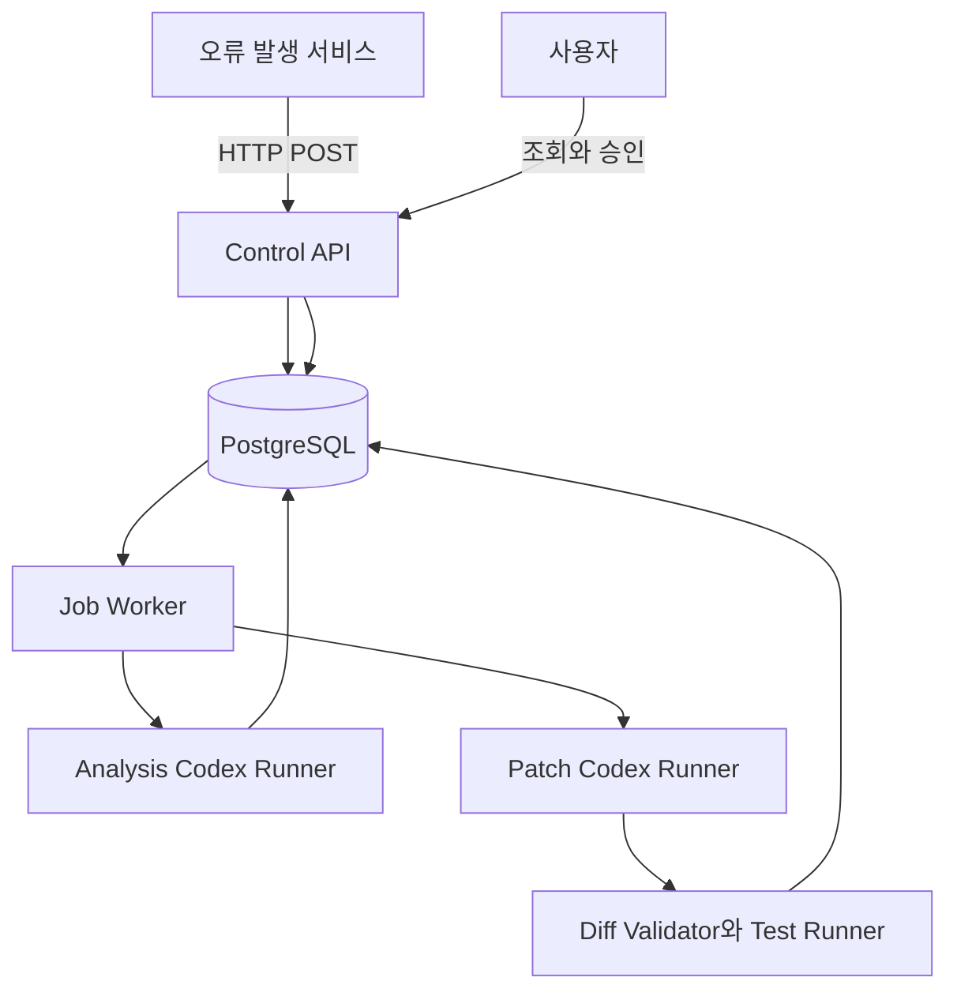
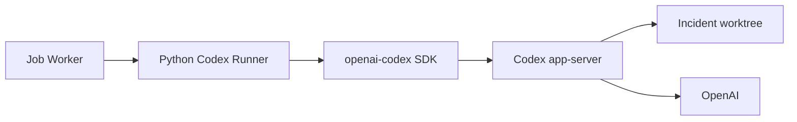
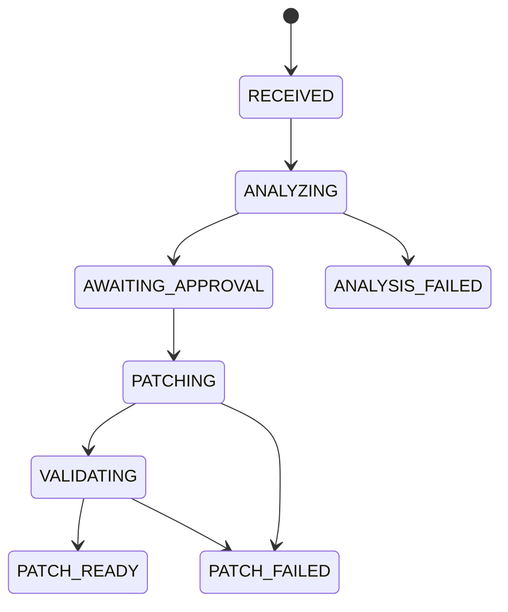

# Auto Error Handler MVP 서비스 아키텍처

상태: Draft  
작성일: 2026-09-01  
범위: 기능 검증용 단일 서비스 MVP

협업 시 결정 상태는 [MVP 의사결정 대장](decision-register.md), 모듈 간 세부 계약은 [DB·Worker·Codex 구현 계약](implementation-contracts.md)을 기준으로 합니다.

## 1. 목표

외부 서비스가 HTTP로 오류 이벤트를 보내면 Auto Error Handler가 등록된 저장소에서 원인을 분석하고, 사용자가 승인한 경우에만 격리된 작업공간에서 패치를 생성합니다. 등록된 검증 명령을 통과한 결과는 diff와 실행 로그로 제공합니다.

MVP가 증명해야 하는 핵심 가치는 다음 하나입니다.

> 실제 오류와 저장소를 연결해 신뢰할 수 있는 원인 분석을 만들고, 승인 전 무변경과 승인 후 제한된 패치를 보장할 수 있는가?

## 2. 범위

### 포함

- 사전 등록된 서비스 설정
- HTTP 오류 이벤트 v1 수신
- `eventId` 기반 멱등성
- 재현 절차, 비식별 입력, 기대·실제 결과를 포함한 분석 context
- fingerprint 기반 Incident grouping
- PostgreSQL 기반 Incident 및 Job 상태 관리
- Codex Python SDK 읽기 전용 분석
- API를 통한 분석 결과 조회와 승인
- 승인 후 별도 Git worktree에서 패치
- allowed/denied path와 diff 크기 검사
- 등록된 lint/test 명령 실행
- diff와 검증 로그 조회

### 제외

- 서비스 인증과 사용자 인증
- 외부 RabbitMQ 및 내부 RabbitMQ
- 조직과 멀티테넌시
- 웹 콘솔과 메신저 알림
- GitHub App과 Pull Request
- 자동 배포
- Kubernetes 및 운영용 고가용성

MVP API는 개발 환경에만 노출합니다.

## 3. 전체 구조



API와 Worker는 하나의 Python 코드베이스를 공유하지만 별도 프로세스로 실행합니다.

```text
control-api   : 요청 수신, 조회, 승인
job-worker    : DB Job 획득, 분석과 패치 실행
postgresql    : 모든 도메인 상태와 Job Queue
```

## 4. 서비스 등록

MVP에서는 UI를 만들지 않고 설정 파일 또는 seed migration으로 서비스를 등록합니다.

```yaml
services:
  fixture-api:
    repositoryPath: /workspace/fixtures/fixture-api
    defaultBranch: main
    runbookPaths:
      - README.md
    allowedPaths:
      - src/**
      - tests/**
    deniedPaths:
      - .github/**
      - infra/**
    maxChangedFiles: 10
    maxDiffLines: 400
    validationCommands:
      - id: unit
        argv: [pytest, -q]
        timeoutSeconds: 300
```

오류 요청에는 `serviceKey`만 포함합니다. API는 등록 정보에서 저장소 경로, 정책, 검증 명령을 조회합니다.

## 5. 요청 처리 흐름

### 5.1 오류 수신

```text
POST /v1/error-events
  → body 크기와 JSON Schema 검증
  → serviceKey로 등록 서비스 조회
  → eventId 중복 확인
  → fingerprint 계산
  → 열린 Incident 조회 또는 생성
  → occurrence 저장
  → 최초 분석이 필요하면 ANALYZE Job 저장
  → COMMIT
  → 202 Accepted
```

Incident 생성과 Job 저장은 같은 DB transaction에서 수행합니다.

### 5.2 분석

Worker는 PostgreSQL에서 `PENDING` Job을 가져옵니다.

```sql
SELECT id
FROM jobs
WHERE status = 'PENDING'
  AND available_at <= now()
ORDER BY created_at
FOR UPDATE SKIP LOCKED
LIMIT 1;
```

분석 실행 순서:

1. Incident의 기준 commit SHA를 결정합니다.
2. 기준 SHA에서 임시 worktree를 만듭니다.
3. 저장소를 read-only로 노출한 Codex Runner를 시작합니다.
4. Codex Python SDK를 `Sandbox.read_only`로 실행합니다.
5. 오류 문구, stack trace, release 정보와 `reproduction` context를 함께 전달합니다.
6. Codex가 제안한 재현·회귀 테스트 계획을 구조화 결과에 포함합니다.
7. 구조화 분석 결과를 검증하고 저장합니다.
8. 성공하면 Incident를 `AWAITING_APPROVAL`로 전환합니다.
9. worktree와 임시 실행 환경을 삭제합니다.

### 5.3 승인

MVP 승인 API에는 사용자 인증이 없습니다.

```text
POST /v1/incidents/{incidentId}/approve
```

승인 request body의 `analysisRunId`와 `expectedBaseCommitSha` 포함 여부는 [DEC-007](decision-register.md)에서 확정합니다. 결정 전 OpenAPI에는 미확정 상태를 명시합니다.

API는 다음만 확인합니다.

- Incident 상태가 `AWAITING_APPROVAL`인지
- 승인 대상 분석 결과가 현재 최신 결과인지
- 기준 commit SHA가 존재하는지
- 같은 승인으로 Patch Job이 이미 생성되지 않았는지

승인 레코드, Incident 상태 변경, Patch Job 저장은 한 transaction에서 처리합니다.

### 5.4 패치와 검증

1. 승인에 묶인 기준 SHA에서 새로운 writable worktree를 만듭니다.
2. 분석 thread를 재사용하지 않고 검증된 분석 결과로 새 Codex thread를 시작합니다.
3. Codex Python SDK를 `Sandbox.workspace_write`로 실행합니다.
4. 실제 Git diff를 읽어 정책을 검사합니다.
5. 등록된 검증 명령을 `shell=False`로 실행합니다.
6. 성공하면 diff와 검증 결과를 저장하고 `PATCH_READY`로 전환합니다.
7. 실패하면 `PATCH_FAILED`로 전환하고 diff와 로그를 보존합니다.

## 6. Codex 실행 모델

Python SDK는 로컬 Codex app-server를 JSON-RPC로 제어합니다. MVP에서는 Worker 프로세스가 Incident별 Runner를 시작합니다.



분석과 패치는 서로 다른 Runner와 thread를 사용합니다. 분석 결과, 기준 SHA, 허용 경로, 검증 명령을 명시적으로 Patch Runner 입력으로 전달합니다.

## 7. 상태 머신



MVP에서는 거절, 승인 만료, 재분석, 재패치 상태를 구현하지 않습니다.

## 8. 데이터 모델

| 테이블 | 역할 |
|---|---|
| `services` | 저장소와 패치·검증 정책 |
| `error_events` | 멱등성 기준이 되는 수신 이벤트 |
| `incidents` | fingerprint로 묶은 사건과 상태 |
| `occurrences` | Incident에 속한 개별 오류 발생 |
| `analysis_runs` | Codex 분석 입력, 결과, 기준 SHA |
| `approvals` | MVP 승인 기록 |
| `patch_runs` | 패치, diff, 검증 결과 |
| `jobs` | PostgreSQL 기반 비동기 Job Queue |

필수 제약:

- `error_events(service_id, event_id) UNIQUE`
- 하나의 Incident에 active analysis run 최대 1개
- 하나의 approval에 patch run 최대 1개
- Incident 상태 변경 시 `version` optimistic lock 사용

## 9. 안전 경계

- 분석 전용 worktree는 read-only입니다.
- 승인 전에는 Patch Job과 writable worktree를 생성하지 않습니다.
- Patch Runner에는 production credential과 Git push credential을 주입하지 않습니다.
- 허용 경로, 금지 경로, 파일 수, diff line 수를 실제 Git diff로 검사합니다.
- symlink, submodule, binary 파일 변경을 차단합니다.
- 검증 명령은 argv 배열로 저장하고 shell interpolation을 사용하지 않습니다.
- 오류 이벤트의 `reproduction`은 untrusted hint로 취급하며 그 안의 문자열을 명령으로 실행하지 않습니다.
- MVP는 로컬 diff만 제공하며 원격 저장소를 변경하지 않습니다.

## 10. 후속 확장 순서

핵심 수직 흐름 검증 후 다음 순서로 확장합니다.

1. GitHub App과 Trusted Git Publisher를 통한 Draft PR
2. 서비스 인증 토큰과 승인자 인증
3. Slack 알림과 승인 링크
4. 내부 RabbitMQ와 안정적인 재시도
5. 멀티테넌시, Secret Manager, 객체 스토리지
6. Kubernetes Job, 관측성, 운영 SLO

외부 RabbitMQ는 실제로 여러 서비스가 공용 이벤트 버스를 요구할 때만 다시 검토합니다.
