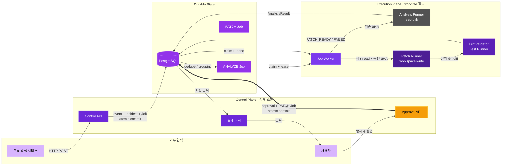
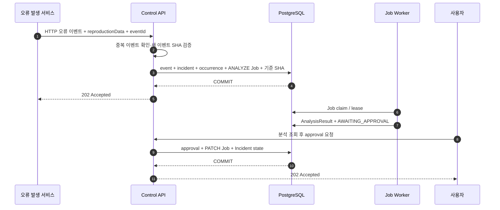
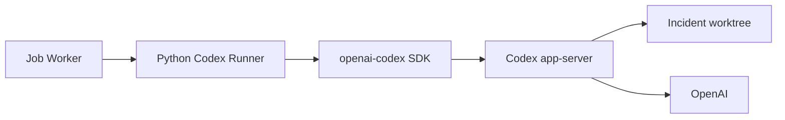
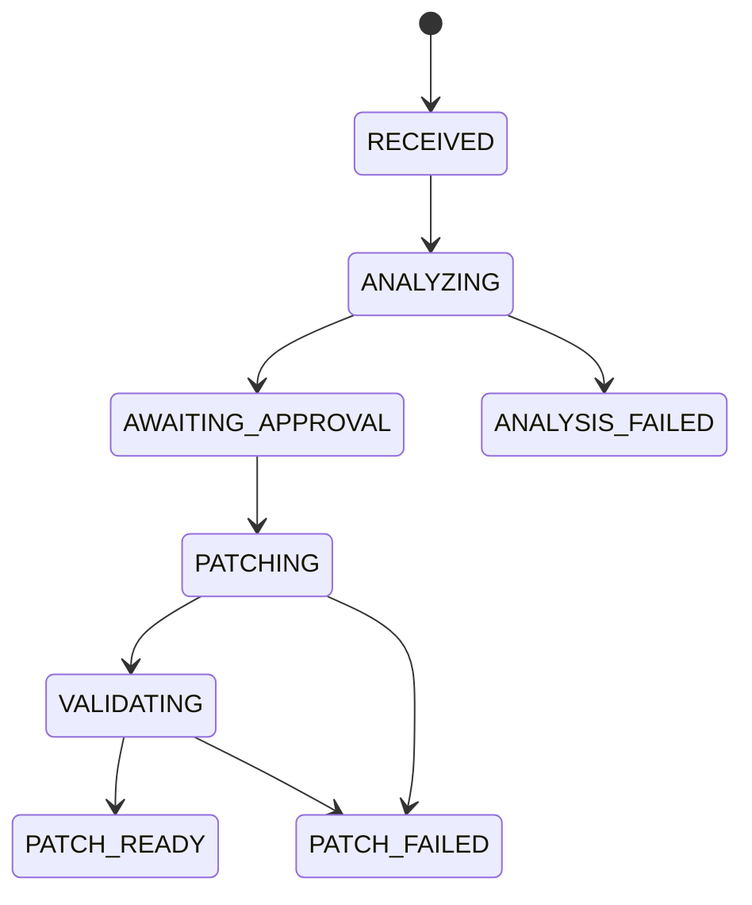

# Auto Error Handler MVP 서비스 아키텍처

상태: 구현 전 설계 — 확정된 의사결정 반영
작성일: 2026-09-01  
범위: 기능 검증용 단일 서비스 MVP

협업 시 결정 상태는 [MVP 의사결정 대장](decision-register.md), 모듈 간 세부 계약은 [DB·Worker·Codex 구현 계약](implementation-contracts.md)을 기준으로 합니다.

## 1. 목표

외부 서비스가 HTTP로 오류 이벤트를 보내면 Auto Error Handler가 등록된 저장소에서 원인을 분석하고, 사용자가 승인한 경우에만 격리된 작업공간에서 패치를 생성합니다. 등록된 검증 명령을 통과한 결과는 diff와 실행 로그로 제공합니다.

MVP가 증명해야 하는 핵심 가치는 다음 하나입니다.

> 실제 오류와 저장소를 연결해 신뢰할 수 있는 원인 분석을 만들고, 승인 전 무변경과 승인 후 제한된 패치를 보장할 수 있는가?

## 2. 범위

### 포함

- 사전 등록된 서비스 설정
- HTTP 오류 이벤트 v1 수신
- `eventId` 기반 멱등성
- 재현 절차, 비식별 입력, 기대·실제 결과를 포함한 분석 context
- fingerprint 기반 Incident grouping
- PostgreSQL 기반 Incident 및 Job 상태 관리
- Codex Python SDK 읽기 전용 분석
- API를 통한 분석 결과 조회와 승인
- 승인 후 별도 Git worktree에서 패치
- allowed/denied path와 diff 크기 검사
- 등록된 lint/test 명령 실행
- diff와 검증 로그 조회

### 제외

- 서비스 인증과 사용자 인증
- 외부 RabbitMQ 및 내부 RabbitMQ
- 조직과 멀티테넌시
- 웹 콘솔과 메신저 알림
- GitHub App과 Pull Request
- 자동 배포
- Kubernetes 및 운영용 고가용성

MVP API는 개발 환경에만 노출합니다.

## 3. 전체 구조



API와 Worker는 하나의 Python 코드베이스를 공유하지만 별도 프로세스로 실행합니다.

핵심 경계는 `APPROVE ==>|approval + PATCH Job atomic commit| DB`입니다. 이 commit 이전에는 `P`의 writable worktree와 `PJOB`가 존재하지 않습니다. 분석은 `read-only` worktree에서 별도 thread로 실행하고, 패치는 승인된 SHA의 새 worktree와 새 thread에서 실행합니다.

### 3.1 접수와 승인 transaction



Codex·Git·validation 실행은 transaction 밖에서 수행하고, 상태와 실행 결과를 확정하는 짧은 transaction만 PostgreSQL에 commit합니다.

새 이벤트의 기준 SHA는 접수 API가 Git 조회로 확인한 뒤 사건 생성 트랜잭션에 접수 당시 저장소 경로와 함께 저장합니다. 같은 `eventId`와 같은 요청 데이터의 재전송은 기존 사건 ID와 현재 상태를 반환하므로 Git을 다시 조회하지 않습니다. 같은 서비스·지문·전체 SHA의 처리 중 사건만 묶습니다. 상세 계약은 [ADR-0001](decisions/0001-event-identity-and-base-sha.md)에 따릅니다.

Worker는 작업을 가져갈 때마다 UUID `claim_token`을 새로 발급합니다. 30초마다 `job_id + claim_token + RUNNING` 조건으로 임대를 갱신하며, 120초 동안 갱신이 없는 작업만 회수합니다. 임대 갱신에 실패하거나 토큰이 바뀌면 진행 중인 Codex 실행을 취소하고 그 결과를 버립니다.

일시적인 기반 시설 오류만 최초 실행을 포함해 최대 3회 시도합니다. 다시 시도할 때는 새 `claim_token`, 새 Codex 대화와 새 작업 공간을 사용합니다. 분석 한 번의 최대 실행 시간은 24시간이며, 이 제한에 도달하면 다시 시도하지 않고 최종 실패로 처리합니다.

```text
control-api   : 요청 수신, 조회, 승인
job-worker    : DB Job 획득, 분석과 패치 실행
postgresql    : 모든 도메인 상태와 Job Queue
```

## 4. 서비스 등록

MVP에서는 UI를 만들지 않고 설정 파일 또는 seed migration으로 서비스를 등록합니다.

```yaml
services:
  fixture-api:
    repositoryPath: /workspace/fixtures/fixture-api
    defaultBranch: main
    runbookPaths:
      - README.md
    allowedPaths:
      - src/**
      - tests/**
    deniedPaths:
      - .github/**
      - infra/**
    maxChangedFiles: 10
    maxDiffLines: 400
    validationCommands:
      - id: unit
        argv: [pytest, -q]
        timeoutSeconds: 300
```

오류 요청에는 `serviceKey`만 포함합니다. API는 등록 정보에서 저장소 경로, 정책, 검증 명령을 조회합니다.

## 5. 요청 처리 흐름

### 5.1 오류 수신

```text
POST /v1/error-events
  → body 크기와 JSON Schema 검증
  → serviceKey로 등록 서비스 조회
  → eventId 중복 확인 및 기존 요청이면 사건 ID·현재 상태 반환
  → 필수 fingerprint 정규화
  → 제공된 release.commitSha 또는 당시 기본 브랜치 HEAD를 전체 SHA로 검증
  → 같은 서비스·지문·전체 SHA의 처리 중 Incident 조회 또는 생성(새 사건이면 저장소 경로도 고정)
  → occurrence 저장
  → 최초 분석이 필요하면 ANALYZE Job 저장
  → COMMIT
  → 202 Accepted
```

Git 조회는 DB 트랜잭션 밖에서 수행합니다. 유효하지 않은 커밋은 `422`, 저장소 일시 장애는 `503`으로 처리하고 이벤트를 저장하지 않습니다. 사건 생성과 작업 저장은 같은 DB 트랜잭션에서 수행합니다. 미완료 작업이 100개면 새 사건을 만드는 접수는 `503`을 반환합니다.

### 5.2 분석

Worker는 PostgreSQL에서 `PENDING` Job을 가져옵니다.

```sql
SELECT id
FROM jobs
WHERE status = 'PENDING'
  AND available_at <= now()
ORDER BY available_at, created_at, id
FOR UPDATE SKIP LOCKED
LIMIT 1;
```

분석 실행 순서:

1. Incident에 저장된 접수 당시 저장소 경로·전체 기준 SHA·첫 이벤트 ID를 읽습니다. 작업자는 저장소나 SHA를 다시 선택하지 않습니다.
2. 첫 분석 선점 때 사건의 저장소 경로와 당시 서비스 정책을 `analysis_runs.policy_snapshot`에 고정하고, 기준 SHA에서 임시 작업 트리를 만듭니다.
3. 저장소를 read-only로 노출한 Codex Runner를 시작합니다.
4. Codex Python SDK를 `Sandbox.read_only`로 실행합니다.
5. 첫 이벤트의 오류 문구, 스택 추적, 릴리스 정보, `reproduction` 설명과 실제 재현에 필요한 `reproductionData`를 함께 전달합니다. 이후 발생 기록은 분석 입력을 바꾸지 않습니다.
6. Codex가 제안한 재현·회귀 테스트 계획을 구조화 결과에 포함합니다.
7. 구조화 분석 결과를 검증하고 저장합니다.
8. 성공하면 Incident를 `AWAITING_APPROVAL`로 전환합니다.
9. worktree와 임시 실행 환경을 삭제합니다.

### 5.3 승인

MVP 승인 API에는 사용자 인증이 없습니다.

```text
POST /v1/incidents/{incidentId}/approve
```

승인 요청은 본문을 받지 않습니다. 서버는 사건을 잠근 뒤 유일한 성공 분석과 그 기준 SHA, 정책 고정 사본을 조회하여 승인 기록과 패치 실행에 연결합니다. 분석 조회 API는 내부 절대 경로를 제외한 정책 요약을 보여줍니다.

API는 다음만 확인합니다.

- Incident 상태가 `AWAITING_APPROVAL`인지
- 성공한 분석 결과가 정확히 하나인지
- 기준 commit SHA가 존재하는지
- 승인할 분석에 정책 고정 사본이 있는지
- 같은 승인으로 Patch Job이 이미 생성되지 않았는지

같은 `Idempotency-Key`의 재요청은 기존 결과를 반환합니다. 다른 키로 이미 승인된 Incident를 다시 승인하면 `409`를 반환합니다. 승인 레코드, Patch 실행 기록, Incident 상태 변경, Patch Job 저장은 한 transaction에서 처리합니다.

### 5.4 패치와 검증

1. 승인에 묶인 기준 SHA와 정책 고정 사본의 저장소 경로에서 새로운 쓰기 가능 작업 트리를 만듭니다.
2. 분석 thread를 재사용하지 않고 검증된 분석 결과로 새 Codex thread를 시작합니다.
3. Codex Python SDK를 `Sandbox.workspace_write`로 실행합니다.
4. 실제 Git 변경 내역을 읽어 승인된 분석의 정책 고정 사본으로 검사합니다.
5. 정책 고정 사본에 등록된 검증 명령을 `shell=False`로 실행합니다.
6. 성공하면 diff와 검증 결과를 저장하고 `PATCH_READY`로 전환합니다.
7. 실패하면 `PATCH_FAILED`로 전환하고 diff와 로그를 보존합니다.

## 6. Codex 실행 모델

Python SDK는 로컬 Codex app-server를 JSON-RPC로 제어합니다. MVP에서는 Worker 프로세스가 Incident별 Runner를 시작합니다.



분석과 패치는 서로 다른 Runner와 thread를 사용합니다. 분석 결과, 기준 SHA, 허용 경로, 검증 명령을 명시적으로 Patch Runner 입력으로 전달합니다.

Python SDK는 작업 시도마다 새 `AsyncCodex` 컨텍스트와 스레드를 사용합니다. Codex 앱 서버의 모델 호출에 필요한 연결은 허용하되, Codex가 실행하는 명령과 별도 검증 명령의 외부 접속은 차단합니다. 고정한 SDK 버전의 취소·시간 초과·하위 프로세스 종료 동작과 통신 경계는 실제 실행 환경 통합 시험으로 확인합니다. 자세한 결정은 [ADR-0002](decisions/0002-frozen-policy-and-execution-network.md)에 기록했습니다.

## 7. 상태 머신



MVP에서는 거절, 승인 만료, 재분석, 재패치 상태를 구현하지 않습니다.

## 8. 데이터 모델

| 테이블 | 역할 |
|---|---|
| `services` | 저장소와 패치·검증 정책 |
| `error_events` | 멱등성 기준이 되는 수신 이벤트 |
| `incidents` | 서비스·지문·전체 SHA로 묶은 사건과 상태, 접수 당시 저장소 경로·첫 이벤트 ID |
| `occurrences` | Incident에 속한 개별 오류 발생 |
| `analysis_runs` | 첫 이벤트 ID, 정책 고정 사본, Codex 분석 결과와 기준 SHA |
| `approvals` | MVP 승인 기록 |
| `patch_runs` | 패치, diff, 검증 결과 |
| `jobs` | PostgreSQL 기반 비동기 Job Queue |

필수 제약:

- `error_events(service_id, event_id) UNIQUE`
- 하나의 Incident에 active analysis run 최대 1개
- 하나의 approval에 patch run 최대 1개
- 사건 상태 변경 시 `version`으로 동시 변경을 검사. 발생 횟수 추가는 `version`을 올리지 않음

## 9. 안전 경계

- 분석 전용 worktree는 read-only입니다.
- 승인 전에는 Patch Job과 writable worktree를 생성하지 않습니다.
- Patch Runner에는 production credential과 Git push credential을 주입하지 않습니다.
- 허용 경로, 금지 경로, 파일 수, diff line 수를 실제 Git diff로 검사합니다.
- symlink, submodule, binary 파일 변경을 차단합니다.
- 검증 명령은 argv 배열로 저장하고 shell interpolation을 사용하지 않습니다.
- Codex 모델 연결과 실행 명령의 통신 권한을 분리합니다. 검증 명령도 네트워크를 차단한 환경에서 실행합니다.
- 오류 이벤트의 `reproduction`은 untrusted hint로 취급하며 그 안의 문자열을 명령으로 실행하지 않습니다.
- MVP는 로컬 diff만 제공하며 원격 저장소를 변경하지 않습니다.

## 10. 후속 확장 순서

핵심 수직 흐름 검증 후 다음 순서로 확장합니다.

1. GitHub App과 Trusted Git Publisher를 통한 Draft PR
2. 서비스 인증 토큰과 승인자 인증
3. Slack 알림과 승인 링크
4. 내부 RabbitMQ와 안정적인 재시도
5. 멀티테넌시, Secret Manager, 객체 스토리지
6. Kubernetes Job, 관측성, 운영 SLO

외부 RabbitMQ는 실제로 여러 서비스가 공용 이벤트 버스를 요구할 때만 다시 검토합니다.
