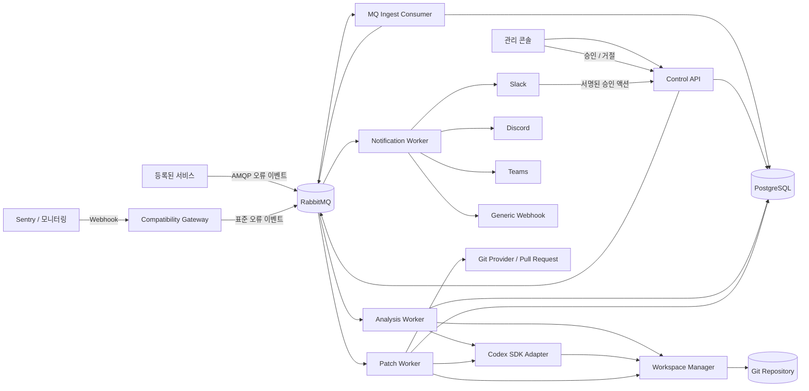
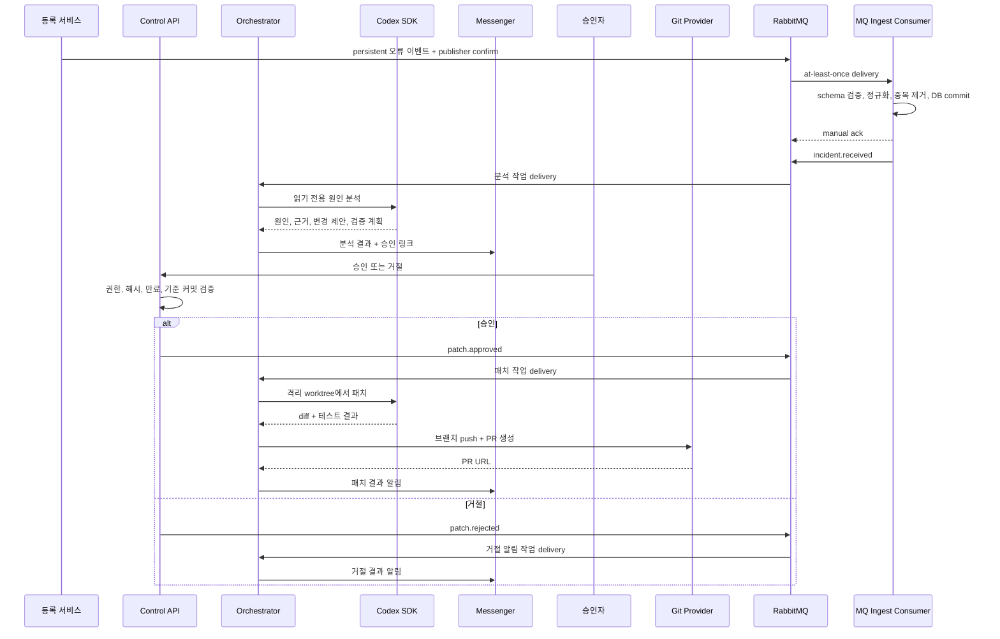
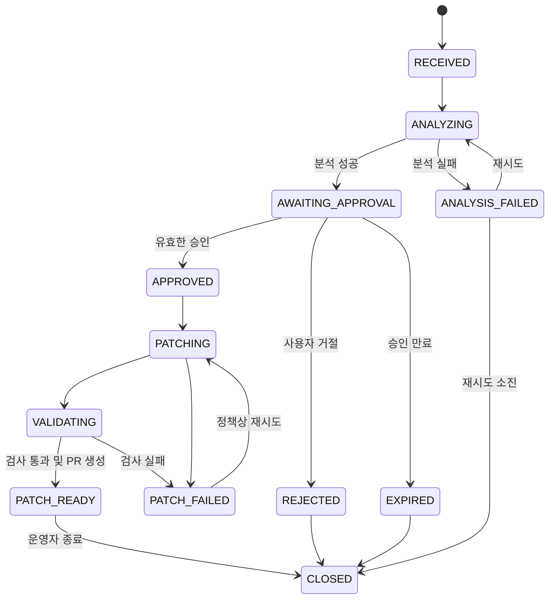

# Auto Error Handler 서비스 아키텍처

상태: Draft  
작성일: 2026-09-01  
대상: MVP 및 운영 버전의 기준 설계

## 1. 한 줄 정의

외부 서비스가 오류 이벤트와 소스 저장소를 등록하면, Auto Error Handler가 Codex SDK로 원인을 분석하고 여러 메신저에 결과를 알린 뒤, 권한 있는 사용자가 명시적으로 승인할 때만 격리된 작업공간에서 패치를 생성·검증하고 Pull Request를 만드는 서비스다.

## 2. 목표와 범위

### 목표

1. 여러 서비스가 MQ로 발행한 오류 이벤트를 하나의 표준 형식으로 수집한다.
2. 오류, 로그, 배포 정보와 저장소 코드를 연결해 Codex가 원인을 조사한다.
3. 분석 결과를 Slack, Discord, Microsoft Teams 및 일반 Webhook으로 전달한다.
4. 사용자 승인 전에는 저장소 파일을 변경하지 않는다.
5. 승인 후에도 운영 환경을 직접 변경하지 않고 격리된 Git 작업공간에서 패치한다.
6. 테스트와 정책 검사를 통과한 패치만 브랜치 또는 Pull Request로 제안한다.
7. 사건 접수부터 패치 결과까지 모든 행위를 추적 가능하게 남긴다.

### MVP에서 하지 않는 것

- 운영 환경으로의 자동 배포
- 데이터베이스 마이그레이션의 자동 실행
- 프로덕션 셸 또는 Kubernetes 클러스터에 대한 Codex의 직접 접근
- 메신저 메시지 본문만으로 승인자를 판별하는 느슨한 승인
- 여러 저장소에 걸친 원자적 패치
- Codex 분석만으로 장애를 자동 종료하는 기능

## 3. 핵심 안전 원칙

### 읽기와 쓰기의 분리

장애 처리를 두 개의 Codex 실행 단계로 나눈다.

| 단계 | 실행 권한 | 가능한 작업 | 금지되는 작업 |
|---|---|---|---|
| 원인 분석 | 읽기 전용 | 코드·로그·설정 조회, 원인 후보와 패치 계획 작성 | 파일 수정, 커밋, 외부 시스템 변경 |
| 승인 후 패치 | 격리 작업공간 쓰기 | 승인 범위 내 파일 수정, 테스트, diff·커밋·PR 생성 | 운영 배포, 승인 범위 밖 변경, 보호 브랜치 직접 push |

승인은 분석 결과에 대한 포괄적 동의가 아니라 특정 저장소, 기준 커밋, 변경 범위, 만료 시간을 가진 일회성 권한이다.

### 운영 환경과의 격리

- Codex 작업공간은 사건별 임시 Git worktree 또는 일회성 컨테이너로 만든다.
- 저장소는 등록 시 허용한 조직과 URL만 clone/fetch할 수 있다.
- 분석 단계에는 저장소 쓰기 자격 증명을 제공하지 않는다.
- 패치 단계에는 해당 저장소의 임시 최소 권한 토큰만 제공한다.
- 테스트 명령은 등록된 allowlist와 리소스 한도 안에서 실행한다.
- 비밀 값은 프롬프트, 로그, 분석 결과, 메신저 알림에 포함하지 않는다.

## 4. 상위 구조

MVP는 배포와 운영이 단순한 모듈러 모놀리스로 시작한다. API 서버와 Worker는 동일한 도메인 패키지를 공유하지만 별도 프로세스로 실행한다. 부하 또는 보안 경계가 명확해지면 Ingest, Analysis, Notification, Patch Worker를 독립 서비스로 분리한다.



## 5. 구성요소 책임

### 5.1 MQ Ingest Consumer

- RabbitMQ의 외부 오류 이벤트 queue를 manual acknowledgement 방식으로 소비한다.
- 메시지 envelope와 payload를 v1 JSON Schema로 검증한다.
- `message_id + service_id`로 중복을 제거하고 PostgreSQL에 사건과 occurrence를 기록한다.
- DB transaction이 commit된 다음에만 메시지를 ack한다.
- 일시 오류는 retry queue로 보내고, 영구적인 schema·권한 오류는 DLQ로 보낸다.
- 저장된 사건을 분석하도록 Outbox 메시지를 RabbitMQ에 발행한다.

외부 생산자 계약은 [외부 오류 이벤트 MQ 메시지 계약 v1](contracts/external-error-event-v1.md)에 정의한다.

### 5.2 Control API

- 서비스, 저장소, 이벤트 소스, 알림 채널 등록 및 변경
- MQ 연결 정보와 생산자 credential 발급·회수
- 사건 조회 및 상태 전이 명령 처리
- 승인자 인증과 승인 정책 검증
- Webhook 호환 Gateway와 메신저 callback의 서명 검증
- 사용자용 승인 페이지와 운영 콘솔 API 제공

Control API는 분석이나 패치를 요청 스레드에서 직접 실행하지 않는다. 트랜잭션으로 상태와 Outbox 이벤트를 기록하고 Worker가 비동기로 처리하게 한다.

### 5.3 Incident Orchestrator

- 한 사건의 상태 머신을 소유한다.
- 분석, 알림, 승인 만료, 패치, 검증 작업을 순서대로 예약한다.
- 같은 오류의 반복 이벤트를 fingerprint로 묶는다.
- 재시도 가능한 실패와 운영자 개입이 필요한 실패를 구분한다.
- 모든 상태 전이를 감사 로그와 함께 원자적으로 기록한다.

### 5.4 Workspace Manager

- 등록된 Git 저장소를 안전하게 fetch한다.
- 사건이 수신된 시점의 `base_commit_sha`를 고정한다.
- 사건별 임시 worktree 또는 컨테이너를 만든다.
- 분석 단계는 읽기 전용으로 mount한다.
- 승인 후 패치 단계는 새 브랜치의 격리 공간에만 쓰기를 허용한다.
- 실행 종료 후 결과물만 보존하고 작업공간과 임시 자격 증명을 폐기한다.

### 5.5 Codex SDK Adapter

OpenAI 공식 문서의 Codex SDK는 서버 측 Node.js 환경에서 로컬 Codex thread를 시작하고, 같은 thread를 이어 실행하거나 ID로 재개할 수 있다. Adapter는 SDK 세부사항이 도메인 로직으로 새지 않도록 다음 인터페이스를 제공한다.

```ts
type AnalyzeIncidentInput = {
  incidentId: string;
  workspacePath: string;
  baseCommitSha: string;
  normalizedEvent: NormalizedErrorEvent;
  repositoryContext: RepositoryContext;
};

type AnalysisResult = {
  summary: string;
  rootCause: string;
  confidence: "low" | "medium" | "high";
  evidence: EvidenceReference[];
  proposedChanges: ProposedChange[];
  validationPlan: string[];
  risk: "low" | "medium" | "high";
};

interface CodexGateway {
  analyze(input: AnalyzeIncidentInput): Promise<AnalysisResult>;
  patch(input: ApprovedPatchInput): Promise<PatchResult>;
}
```

SDK의 최소 실행 형태는 다음과 같다. 실제 SDK 옵션은 구현 시 설치된 버전의 타입 정의를 기준으로 고정한다.

```ts
import { Codex } from "@openai/codex-sdk";

const codex = new Codex();
const thread = codex.startThread();
const result = await thread.run(prompt);
```

Adapter는 다음도 담당한다.

- 사건과 Codex thread ID 연결 및 재개
- 프롬프트 템플릿 버전 관리
- 구조화 결과 파싱과 스키마 검증
- 실행 시간, 오류, 토큰 및 비용 메타데이터 기록
- 허용 시간 초과 시 실행 취소
- SDK 출력에서 비밀 값과 과도한 로그 제거

Codex SDK를 내부 도구와 CI/CD에 결합할 수 있고 thread를 시작·계속·재개할 수 있다는 근거는 [OpenAI 공식 Codex SDK 문서](https://developers.openai.com/codex/sdk)에 둔다.

### 5.6 Notification Hub

메신저별 구현을 공통 인터페이스 뒤에 둔다.

```ts
interface NotificationChannel {
  sendAnalysisReady(message: AnalysisReadyMessage): Promise<DeliveryReceipt>;
  sendPatchStarted(message: PatchStartedMessage): Promise<DeliveryReceipt>;
  sendPatchResult(message: PatchResultMessage): Promise<DeliveryReceipt>;
  verifyInteraction?(request: SignedInteraction): Promise<VerifiedActor>;
}
```

MVP 지원 순서:

1. Slack App: Block Kit 버튼과 서명 검증
2. Discord Webhook: 알림 전용, 승인은 웹 콘솔 링크 사용
3. Microsoft Teams Incoming Webhook: 알림 전용, 승인은 웹 콘솔 링크 사용
4. Generic Webhook: 고객 내부 메시징 게이트웨이 연결

알림 실패는 분석 또는 패치 결과를 되돌리지 않는다. `delivery_attempts`에 기록하고 지수 백오프로 재시도하며, 최종 실패는 운영 채널로 보낸다.

### 5.7 Approval Service

- 승인 가능 사용자와 역할을 서비스별로 검증한다.
- 승인 요청에 사건 ID, 저장소 ID, 기준 커밋, 제안 변경 해시, 만료 시간을 묶는다.
- 승인 토큰은 일회용이며 원문을 저장하지 않고 해시만 보관한다.
- 동일 요청의 중복 클릭은 idempotent하게 처리한다.
- 승인 후 저장소 HEAD 또는 제안 변경이 달라졌으면 기존 승인을 무효화하고 재분석한다.
- 위험도가 높은 변경은 2인 승인 정책으로 확장할 수 있다.

### 5.8 Patch Worker

1. 승인 레코드를 다시 검증하고 원자적으로 소비한다.
2. 고정된 기준 커밋에서 새 worktree와 브랜치를 만든다.
3. Codex thread를 재개해 승인된 변경 범위만 구현하도록 지시한다.
4. 변경 파일 allowlist, diff 크기, 금지 경로를 검사한다.
5. 등록된 lint, typecheck, unit/integration test를 실행한다.
6. 실패 시 한정된 횟수만 같은 thread에서 수정·재검증한다.
7. 성공하면 커밋하고 Pull Request를 생성한다.
8. 결과를 저장하고 모든 채널에 알린다.

기본 정책은 `PR 생성 후 사람이 merge`다. 운영 배포는 이 서비스 범위 밖에 둔다.

## 6. 전체 처리 흐름



## 7. 사건 상태 머신



상태 전이는 `expected_version`을 이용한 optimistic lock으로 보호한다. MQ 메시지는 최소 한 번 전달될 수 있다고 가정하며 모든 handler는 `message_id`와 작업 종류를 기준으로 idempotent해야 한다.

## 8. 서비스 등록 모델

서비스 등록 시 아래 정보가 필요하다.

```json
{
  "name": "payments-api",
  "environment": "production",
  "repository": {
    "provider": "github",
    "url": "https://github.com/example/payments-api",
    "defaultBranch": "main",
    "installationId": "secret-reference"
  },
  "eventSource": {
    "type": "rabbitmq",
    "protocol": "amqps",
    "virtualHost": "tenant-acme",
    "exchange": "aeh.external.error.v1",
    "routingKey": "error.payments-api.production.error"
  },
  "diagnostics": {
    "allowedLogSources": ["sentry"],
    "runbookPaths": ["README.md", "docs/runbook.md"],
    "testCommands": ["npm run lint", "npm test"],
    "timeoutSeconds": 900
  },
  "patchPolicy": {
    "allowedPaths": ["src/**", "test/**"],
    "deniedPaths": [".github/workflows/**", "infra/production/**"],
    "maxChangedFiles": 20,
    "maxDiffLines": 800,
    "requiredApprovals": 1
  },
  "channels": [
    { "type": "slack", "target": "#payments-alerts" },
    { "type": "discord", "target": "secret-reference" }
  ]
}
```

`secret-reference`는 실제 비밀 값이 아니라 Secret Manager/Vault의 참조다. 등록 응답은 서비스 전용 AMQPS 접속 정보, publish-only credential, exchange, routing key, 메시지 schema URL을 제공한다. credential 원문은 최초 한 번만 표시한다.

## 9. 오류 이벤트 표준 계약

외부 서비스는 [외부 오류 이벤트 MQ 메시지 계약 v1](contracts/external-error-event-v1.md)에 맞춰 RabbitMQ에 발행한다. MQ Ingest Consumer는 이 payload를 내부의 `NormalizedErrorEvent`로 변환한다.

```ts
type NormalizedErrorEvent = {
  eventId: string;
  serviceId: string;
  occurredAt: string;
  environment: string;
  severity: "warning" | "error" | "critical";
  title: string;
  message: string;
  stackTrace?: string;
  release?: string;
  commitSha?: string;
  traceId?: string;
  requestId?: string;
  tags: Record<string, string>;
  logReferences: Array<{
    provider: string;
    locator: string;
  }>;
};
```

수신 규칙:

- `message_id + serviceId`를 idempotency key로 사용한다.
- 본문 크기와 stack trace 길이에 상한을 둔다.
- 토큰, 쿠키, Authorization 헤더, 이메일 등은 저장 전에 마스킹한다.
- 원본 payload는 짧은 보존 기간의 암호화 스토리지에 저장하고, 분석에는 정규화된 최소 정보만 전달한다.
- 동일 fingerprint의 반복 오류는 기존 열린 사건에 occurrence로 추가한다.

## 10. 외부 API 초안

| Method | Path | 설명 |
|---|---|---|
| `POST` | `/v1/services` | 서비스와 저장소 등록 |
| `GET` | `/v1/services` | 접근 가능한 서비스 목록 |
| `GET` | `/v1/services/:serviceId` | 등록 정보 조회 |
| `PATCH` | `/v1/services/:serviceId` | 정책·채널 변경 |
| `POST` | `/v1/integrations/sentry/webhook` | 호환 Gateway가 Sentry 이벤트를 받아 MQ로 발행 |
| `GET` | `/v1/incidents` | 사건 목록과 필터 조회 |
| `GET` | `/v1/incidents/:incidentId` | 분석, 승인, 패치 상태 조회 |
| `POST` | `/v1/incidents/:incidentId/approvals` | 패치 승인 |
| `POST` | `/v1/incidents/:incidentId/rejections` | 패치 거절 |
| `POST` | `/v1/incidents/:incidentId/reanalyze` | 권한 있는 사용자의 재분석 요청 |
| `POST` | `/v1/integrations/slack/actions` | Slack 서명 액션 수신 |

오류 이벤트의 기본 수신 경로는 HTTP API가 아니라 RabbitMQ다. HTTP Webhook은 MQ 생산자가 없는 공급자를 위한 호환 Gateway로만 제공한다. 쓰기 API는 `Idempotency-Key`를 지원한다. 승인·거절 API는 로그인 세션 또는 짧은 수명의 서명된 링크와 서버 측 권한 검증을 모두 요구한다.

## 11. 데이터 모델

| 테이블 | 핵심 필드 | 역할 |
|---|---|---|
| `organizations` | `id`, `name` | 멀티테넌트 경계 |
| `users` | `id`, `organization_id`, `role` | 승인자 및 운영자 |
| `services` | `id`, `organization_id`, `name`, `environment` | 등록 서비스 |
| `repositories` | `id`, `service_id`, `provider`, `url`, `default_branch` | 분석 대상 코드 |
| `event_sources` | `id`, `service_id`, `type`, `secret_ref` | 오류 수신 설정 |
| `notification_channels` | `id`, `service_id`, `type`, `config_ref` | 메신저 설정 |
| `incidents` | `id`, `service_id`, `fingerprint`, `state`, `version` | 사건과 상태 머신 |
| `occurrences` | `id`, `incident_id`, `message_id`, `payload_ref` | 반복 오류 기록과 MQ 중복 제거 |
| `analysis_runs` | `id`, `incident_id`, `thread_id`, `result`, `prompt_version` | Codex 분석 실행 |
| `approval_requests` | `id`, `incident_id`, `proposal_hash`, `expires_at`, `consumed_at` | 승인 대상과 일회성 토큰 |
| `approvals` | `id`, `request_id`, `actor_id`, `decision`, `reason` | 승인 감사 정보 |
| `patch_runs` | `id`, `incident_id`, `base_sha`, `branch`, `status`, `diff_ref`, `pr_url` | 패치와 검증 결과 |
| `delivery_attempts` | `id`, `incident_id`, `channel_id`, `status`, `attempt` | 알림 전달 결과 |
| `outbox_events` | `id`, `aggregate_id`, `type`, `payload`, `published_at` | DB와 Queue 사이 일관성 |
| `audit_logs` | `id`, `actor`, `action`, `target`, `metadata`, `created_at` | 변경 불가능한 감사 로그 |

큰 로그와 diff는 객체 스토리지에 암호화해 저장하고 DB에는 위치, checksum, 크기, 보존 기한만 둔다.

## 12. Codex 프롬프트 계약

### 분석 프롬프트가 반드시 포함할 정보

- 사건 ID와 고정된 기준 커밋
- 정규화된 오류와 제한된 진단 정보
- 저장소별 `AGENTS.md` 및 runbook 지침
- 읽기 전용이며 파일을 변경해서는 안 된다는 명시적 제약
- 추측과 코드로 확인된 사실을 분리하라는 요구
- 출력 JSON Schema

분석 결과의 각 원인 주장은 파일·심볼·로그 줄 등 확인 가능한 근거를 가져야 한다. 근거가 부족하면 `confidence=low`로 반환하고 승인을 요청하지 않은 채 사람에게 추가 정보를 요청할 수 있다.

### 패치 프롬프트가 반드시 포함할 정보

- 승인 레코드 ID와 승인된 제안의 hash
- 변경 가능한 경로와 금지 경로
- 최대 변경 파일 수와 diff 크기
- 실행 가능한 검증 명령
- 불필요한 리팩터링 금지
- 테스트 실패를 숨기거나 삭제하지 말라는 제약
- 최종 변경 요약과 남은 위험을 구조화해 반환하라는 요구

프롬프트만 보안 경계로 신뢰하지 않는다. 동일한 제약을 Workspace Manager, Git diff validator, 명령 allowlist에서도 강제한다.

## 13. 승인 메시지 예시

```text
[payments-api / production] NullReference 오류 원인 분석 완료

원인: PaymentMethod 조회 결과가 null일 때 validateCard()가 직접 접근합니다.
신뢰도: 높음
근거: src/payment/validator.ts, 관련 stack trace 3건
제안: null guard 추가 + 회귀 테스트 2건
위험도: 낮음
기준 커밋: a1b2c3d

[상세 보기] [패치 승인] [거절]
승인 만료: 30분 후
```

메신저에는 비밀 값, 전체 stack trace, 사용자 개인정보를 보내지 않는다. 승인 버튼은 사건 상세 페이지로 연결하고, 서버가 사용자 인증과 최신 상태를 다시 확인한다.

## 14. 실패와 복구 정책

| 실패 지점 | 처리 |
|---|---|
| 이벤트 중복 수신 | 기존 occurrence 반환, 새 분석 작업 생성 금지 |
| 저장소 fetch 실패 | 제한 재시도 후 `ANALYSIS_FAILED`, 운영 알림 |
| Codex timeout | 실행 취소, 한 번 재시도 후 실패 상태 |
| 분석 결과 schema 오류 | 자동 재요청 1회, 이후 운영 검토 |
| 메신저 rate limit | `Retry-After` 준수, 채널별 재시도 |
| 승인 직전 기준 브랜치 이동 | 고정 SHA는 유지하되 충돌 위험 표시, 정책에 따라 재분석 |
| 승인 후 proposal hash 불일치 | 승인 무효화, 패치 시작 금지 |
| 테스트 실패 | 제한된 수정 루프 후 `PATCH_FAILED`, diff와 로그 제공 |
| PR 생성 실패 | 검증된 커밋 보존 후 재시도, 중복 PR 방지 |

Worker는 heartbeat와 lease를 사용한다. lease가 만료된 작업은 다시 예약할 수 있지만, 외부 side effect에는 idempotency key를 사용한다.

## 15. 보안과 권한

### 인증·인가

- 운영 콘솔: 조직 SSO/OIDC
- MQ 생산자: 조직별 vhost, 서비스별 publish-only credential, routing prefix 권한
- Webhook 호환 Gateway: 서비스별 HMAC 또는 공급자 서명
- Git: GitHub App 등 설치 단위 최소 권한
- 메신저 Callback: 공급자 서명과 timestamp 검증
- 승인: RBAC, 사건 소속 조직 검증, 일회성 승인 요청 검증

### 비밀 관리

- 환경 파일이나 DB 평문 대신 Vault/KMS/클라우드 Secret Manager를 사용한다.
- Worker는 작업 시작 시 단기 자격 증명을 받아 종료 시 폐기한다.
- 프롬프트 전에 알려진 비밀 패턴을 마스킹하고, 응답 후에도 다시 검사한다.
- Git diff에 고신뢰도 비밀 탐지 결과가 있으면 PR 생성을 차단한다.

### 패치 정책 기본값

- 보호 브랜치 직접 push 금지
- force push 금지
- 서브모듈 URL 변경 금지
- CI/CD, 배포, IAM, production infra 경로 변경 금지
- lockfile 변경은 승인 제안에 명시된 경우만 허용
- 바이너리 파일 추가 금지
- `git diff --check`, lint, typecheck, test 통과 요구

## 16. 관측성과 운영 지표

### 주요 지표

- 이벤트 수신부터 분석 완료까지의 시간
- 분석 성공률과 schema 검증 실패율
- 원인 분석 승인율과 거절 사유
- 승인부터 PR 생성까지의 시간
- 패치 검증 성공률
- 생성된 PR의 최종 merge율과 rollback율
- 채널별 알림 성공률과 지연
- 사건당 Codex 실행 시간·비용
- 동일 fingerprint의 재발률

### 추적

`incident_id`, `analysis_run_id`, `patch_run_id`, `codex_thread_id`, `trace_id`를 구조화 로그와 분산 trace에 공통 필드로 넣는다. 사용자에게 노출하는 ID와 내부 실행 ID를 구분한다.

## 17. 권장 기술 구성

| 영역 | MVP 선택 | 이유 |
|---|---|---|
| 언어 | TypeScript | Codex TypeScript SDK와 단일 타입 시스템 |
| 런타임 | Node.js 20+ | SDK 요구사항인 Node.js 18+를 충족하고 LTS 사용 |
| API | Fastify | 작은 오버헤드와 schema 기반 검증 |
| DB | PostgreSQL | 상태 전이, 감사 로그, Outbox 트랜잭션 |
| ORM | Prisma 또는 Drizzle | migration과 타입 안전성 |
| Message Queue | RabbitMQ quorum queue | 외부 수신과 내부 작업의 durable 전달, publisher confirm, manual ack, DLQ |
| 객체 스토리지 | S3 호환 스토리지 | 로그와 diff의 암호화·보존 정책 |
| Git 연동 | GitHub App 우선 | 저장소 단위 최소 권한과 PR 자동화 |
| 관측성 | OpenTelemetry | API, Worker, 외부 호출의 공통 trace |
| 배포 | API/Worker 분리 컨테이너 | 독립 확장과 권한 분리 |

RabbitMQ 장애가 전체 상태를 잃게 하지 않도록 사건의 진실 공급원은 PostgreSQL로 유지한다. 외부 이벤트는 persistent message, publisher confirm, durable exchange, quorum queue를 사용한다. Consumer는 DB commit 이후 manual ack한다. 내부 작업 메시지에는 재생성 가능한 ID만 넣고 큰 payload는 넣지 않는다.

## 18. 권장 코드 구조

```text
src/
  api/
    routes/
    middleware/
  domain/
    services/
    incidents/
    approvals/
    policies/
  application/
    commands/
    queries/
    workflows/
  infrastructure/
    codex/
    git/
    messaging/
    persistence/
    secrets/
    telemetry/
  integrations/
    rabbitmq/
    sentry/
    slack/
    discord/
    teams/
    webhooks/
  workers/
    ingest-worker.ts
    analysis-worker.ts
    patch-worker.ts
    notification-worker.ts
  prompts/
    analyze-incident.ts
    apply-approved-patch.ts
test/
  unit/
  integration/
  contract/
  e2e/
```

도메인 계층은 Codex SDK, GitHub, Slack 타입에 의존하지 않는다. 외부 연동은 port/adapter로 감싸 테스트에서 가짜 구현으로 교체한다.

## 19. 단계별 구현 계획

### Phase 1 — 단일 서비스 수직 슬라이스

- TypeScript 프로젝트와 API/Worker 기본 구조
- PostgreSQL schema와 사건 상태 머신
- RabbitMQ topology와 서비스별 publish-only credential
- 외부 오류 이벤트 v1 schema 검증, 중복 제거, retry, DLQ
- 로컬 Git 저장소 기반 Workspace Manager
- Codex 읽기 전용 분석
- Slack 또는 콘솔 알림
- 웹 콘솔 승인
- 승인 후 격리 패치와 로컬 검증
- 감사 로그와 기본 테스트

완료 기준: 샘플 저장소에서 의도적으로 발생시킨 오류가 접수되고, 승인 전에는 diff가 없으며, 승인 후 테스트를 통과한 diff가 생성된다.

### Phase 2 — 실제 협업 도구 연결

- GitHub App과 Pull Request 생성
- Slack interactive approval
- Discord, Teams, Generic Webhook adapter
- Sentry adapter
- Secret Manager와 OIDC
- Webhook-to-MQ compatibility gateway와 Outbox relay

완료 기준: 동일 사건의 중복 이벤트와 중복 승인에도 PR과 알림이 한 번만 생성된다.

### Phase 3 — 운영 강화

- 멀티테넌시와 조직별 정책
- 2인 승인과 고위험 경로 정책
- 객체 스토리지 보존·삭제 정책
- Codex 비용·동시성 제한
- OpenTelemetry dashboard와 SLO
- 재분석, 재패치, 사고 회고 데이터

완료 기준: 장애, 재시도, credential rotation, Worker 재시작 상황에서 상태가 복구되고 감사 추적이 보존된다.

## 20. 테스트 전략

### 단위 테스트

- 상태 머신의 유효·무효 전이
- 승인 만료, 일회성 소비, proposal hash 검증
- fingerprint와 이벤트 중복 제거
- 경로 allowlist/denylist와 diff 제한
- 메신저 payload redaction

### 계약 테스트

- 외부 오류 이벤트 v1 JSON Schema와 AMQP property
- Sentry Webhook-to-MQ payload 변환
- Slack action signature 검증
- Codex 구조화 결과 schema
- Git provider의 branch/PR idempotency

### 통합 테스트

- PostgreSQL Outbox에서 RabbitMQ 발행과 publisher confirm
- Consumer DB commit 이전 장애 시 redelivery와 중복 제거
- 사건별 worktree 생성과 정리
- 분석 단계의 파일 쓰기 차단
- 승인 이후에만 Patch Worker가 실행되는지 검증
- 테스트 실패 시 PR이 생성되지 않는지 검증

### E2E 테스트

결함이 심어진 fixture 저장소를 사용한다.

1. 오류 이벤트를 RabbitMQ에 발행하고 publisher confirm을 확인한다.
2. 분석 결과와 승인 요청을 확인한다.
3. 승인 전 fixture 저장소의 diff가 비어 있는지 확인한다.
4. 승인한다.
5. 패치, 테스트 결과, 브랜치와 PR URL을 확인한다.
6. 동일 이벤트와 승인을 재전송해 중복 side effect가 없는지 확인한다.

## 21. 구현 전 확정할 제품 결정

아래 항목은 구현 전에 기본값을 선택해야 한다. 제안 기본값도 함께 적었다.

| 결정 | 제안 기본값 |
|---|---|
| 첫 Git 공급자 | GitHub App |
| 외부 이벤트 전송 | RabbitMQ AMQPS + v1 JSON 계약 |
| 첫 호환 Gateway | Sentry Webhook-to-MQ |
| 첫 승인 UI | 자체 웹 콘솔, Slack은 링크 제공 |
| 첫 메신저 | Slack |
| 패치 결과 | 브랜치 push + Draft PR |
| 승인 만료 | 30분 |
| 승인 인원 | 일반 변경 1명, 고위험 변경 2명 |
| Codex 분석 재시도 | 1회 |
| 패치 수정·검증 루프 | 최대 2회 |
| 자동 merge/deploy | 사용 안 함 |

## 22. 다음 구현 단위

첫 구현은 넓은 연동을 동시에 만드는 대신 다음 하나의 수직 흐름을 완성한다.

```text
RabbitMQ 오류 이벤트 v1
  -> schema 검증 / deduplication / Incident 생성
  -> 로컬 fixture 저장소 읽기 전용 Codex 분석
  -> 콘솔/Slack 알림
  -> 웹 승인
  -> 격리 worktree 패치
  -> 등록된 테스트 실행
  -> diff 결과 제공
```

이 흐름이 승인 전 무변경, 승인 후 제한된 변경, 실패 시 안전 종료를 증명한 다음 GitHub PR과 추가 메신저를 연결한다.
